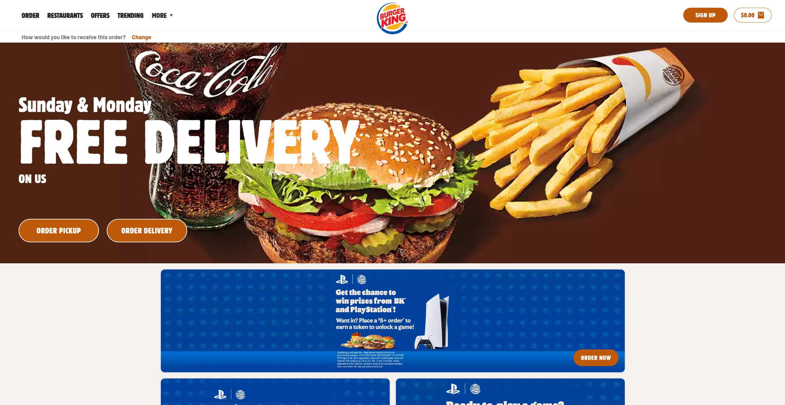

## Table of Contents

* [Overview](#overview)
* [Pages](#pages)

## Overview

### The problem

There are many food choices on campus: campus center, food trucks, Manoa Gardens, Paradise Palms, vending machines, and so forth. Let’s say you have a desire for chinese food today for lunch. What places on campus are serving chinese food menu items today? Alternatively, let’s say that you love the fresh salmon fillet at Campus Center, but that dish is only served once every few weeks. How do you find out on the day that it’s available?

### The solution

The Campus Cravings app aims to solve this problem by providing an up-to-date resource on everything food related at UH Manoa. Our completed product will allow vendors to create online menus detailing when and where certain dishes will be avaliable. Students will be able to view the food avaliable in the moment ans well as browse the top picks of the day.

## Pages

These are the following pages we will use as inspiration for our Campus Cravings website.

### Landing page

The landing page is presented to users when they visit the top-level URL to the site.

### User home page

Similar to the landing page but more detailed about the functions and features of the site.

### Vendor home page

Allows different restaurants, cafes, eateries, food trucks and bars around the campus to specify their choices of the day or modify their profile.

### Admin home page

Management stuff for the owner to administer the website.

### Add Vendor page

Add a vendor for another food establishment.

### User profile page

This page is where user profiles are created. Users can personalize a list of restaurants they love and notify themselves if a menu they like is available.

### Foods available right now page

Presents foods that different establishments on campus are currently serving.

### Today’s top picks page

You know you want it.
