## Digital Ocean Deployment
[http://157.230.89.84/](http://157.230.89.84/#/)

## Table of Contents

* [Overview](#overview)
* [User Guide](#user-guide)
* [Community Feedback](#community-feedback)
* [Developer Guide](#developer-guide)
* [Milestones](#milestones)
* [The Team](#the-team)

## Overview

### The problem
Since University of Hawaii at Manoa's campus has a variety of food vendors, it can be difficult for students and staff to keep up with what's available. Many of the locations on campus have different choices, depending what they decide to offer on any given day. There is no easy and concise way to track all of these options and their daily menus: Paradise Palms, campus center, food trucks, etc.

### The solution
The Campus Cravings app aims to solve this problem by providing an up-to-date resource on everything food related at UH Manoa. Our completed product will allow vendors to create online menus detailing when and where certain dishes will be avaliable. Students will be able to view the food avaliable in the moment as well as browse the top picks of the day.

## User Guide
* [Landing page](#landing-page)
* [Login page](#login-page)
* [Register page](#register-page)
* [User Landing page](#user-landing-page)
* [Vendor Landing page](#vendor-landing-page)
* [Admin Landing page](#admin-landing-page)
* [User Home page](#user-home-page)
* [Vendor Home page](#vendor-home-page)
* [Admin Home page](#admin-home-page)
* [Add Restaurants page](#add-restaurants-page)
* [User Profile page](#user-profile-page)
* [List Restaurants page](#list-restaurants-page)
* [Menu page](#menu-page)
* [Today's Top Picks page](#todays-top-picks-page)
* [Favorites page](#favorites-page)


### Landing page

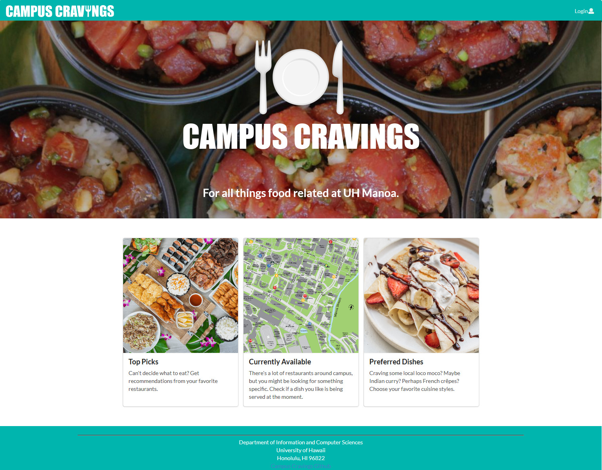

The landing page is presented to users when they first visit the site. This page is meant to capture the user's attention. The banner consists of a large Campus Cravings logo with a picture of delicious poke bowls as the background. Below the banner are three cards that informs a user possible things they can do on the site. 

The next step is to use the Login menu to either Login to an existing account or register a new account.

[Go to landing page.](http://157.230.89.84/#/)

#### Login page

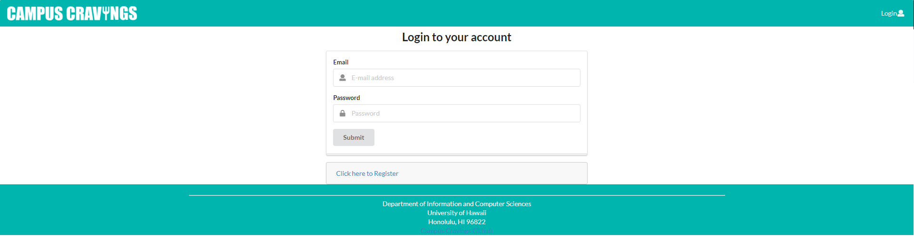

Clicking on the Login link, then on the Sign In menu item displays this page.

[Go to login page.](http://157.230.89.84/#/signin)

#### Register page

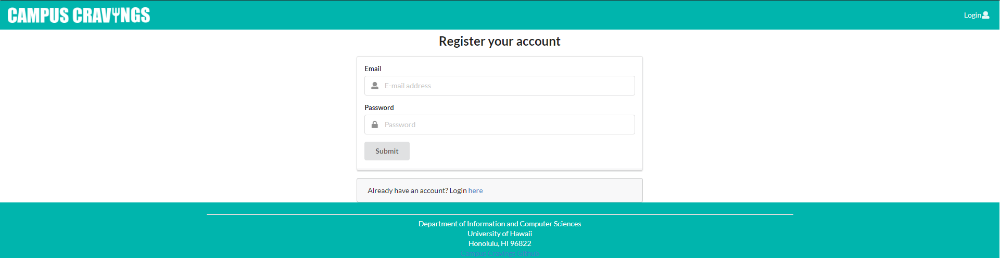

Alternatively, clicking on the Login link, then on the Sign Up menu item displays this page.

[Go to register page.](http://157.230.89.84/#/signup)

#### User Landing Page

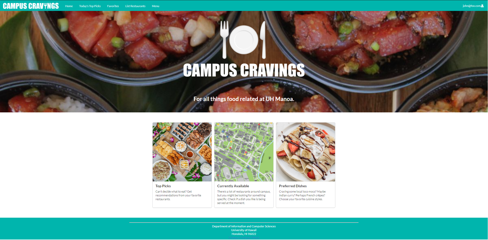

Once you log in to a user account (either to an existing account or by creating a new one), the navbar changes as shown above.

You can now access the home page, today's top picks, favorites, list restaurants, menu, and my profile.

[Go to user landing page.](http://157.230.89.84/#/)

#### Vendor Landing page

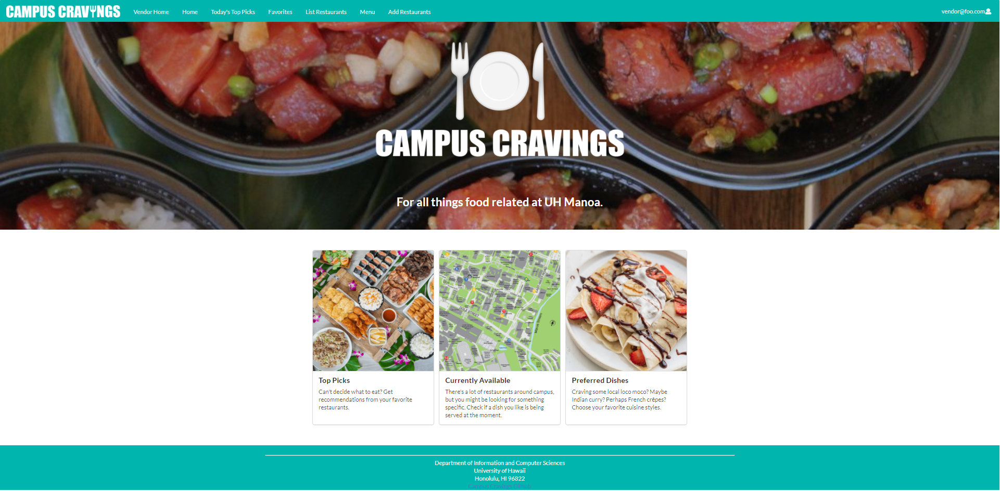

Once you log in to a vendor account (either to an existing account or by creating a new one), the navbar changes as shown above.

On top of the user pages, you can also access the vendor home and add restaurants pages.

[Go to vendor landing page.](http://157.230.89.84/#/)

#### Admin Landing page


Once you log in to a admin account (either to an existing account or by creating a new one), the navbar changes as shown above.

On top of the user pages, you can also access the admin home and admin pages.

[Go to admin landing page.](http://157.230.89.84/#/)

### User Home page

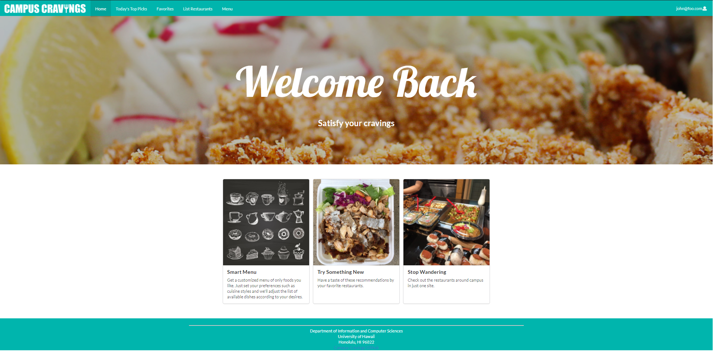

Similar to the landing page but the description and messages are geared more towards encouraging the user to tour other parts of the site, such as a link to edit their profile, view the menu, and view different restaurants. 

[Go to user home page](http://157.230.89.84/#/userhome)

### Vendor Home page

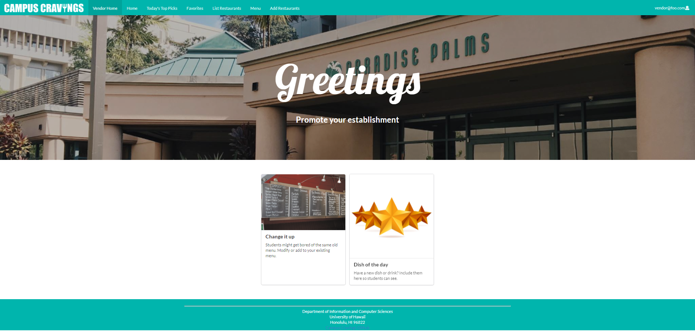

Allows different restaurants, cafes, eateries, food trucks and bars around the campus to specify their choices of the day or modify their profile. *In progress.*

[Go to vendor home page.](http://157.230.89.84/#/vendorhome)

### Admin Home page

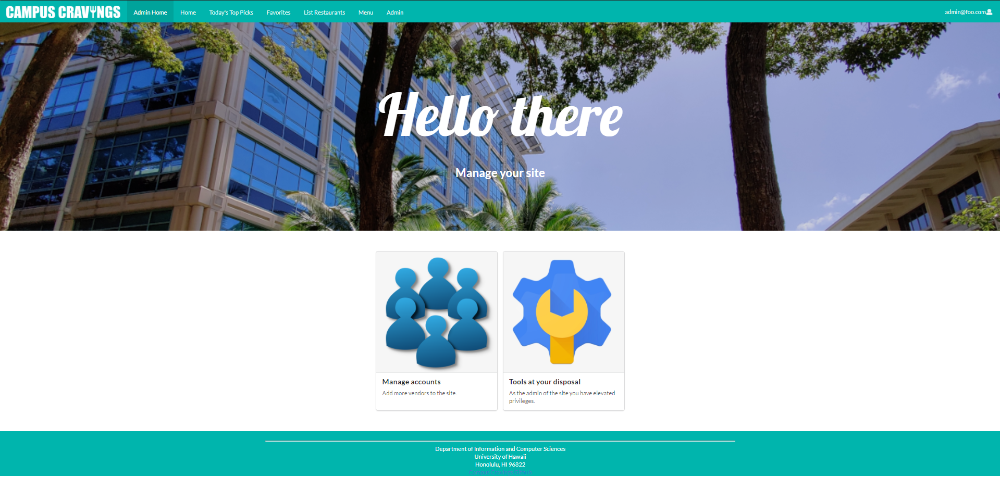

Management stuff for the owner to administer the website. *In progress.*

[Go to admin home page.](http://157.230.89.84/#/adminhome)

### Add Restaurants page

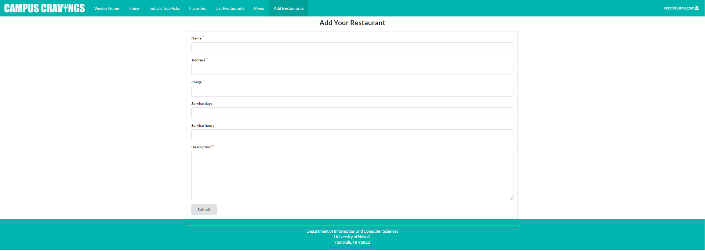

Add a vendor for another food establishment. *In progress.*

[Go to add restaurants page.](http://157.230.89.84/#/add)

### User Profile page

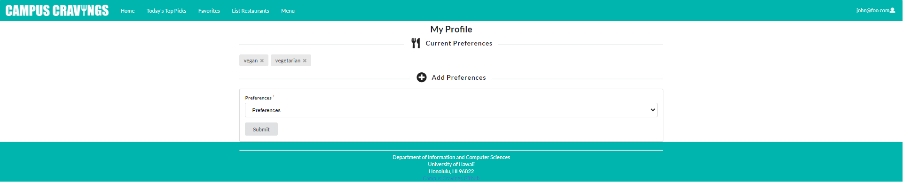

This page is where user profiles are created. Users can add or remove preferences on the food they like to eat (ie. vegan, vegetarian, gluten-free, nut-free, hawaiian, etc.). 

[Go to user profile page.](http://157.230.89.84/#/profile)

### List Restaurants page

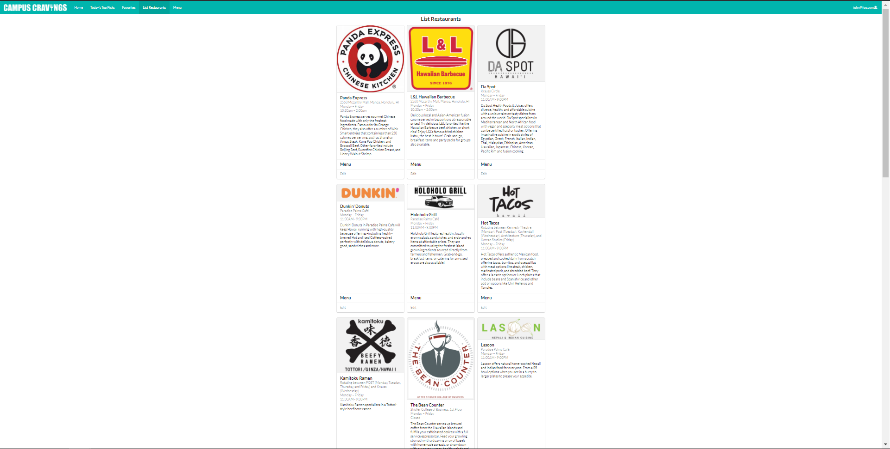
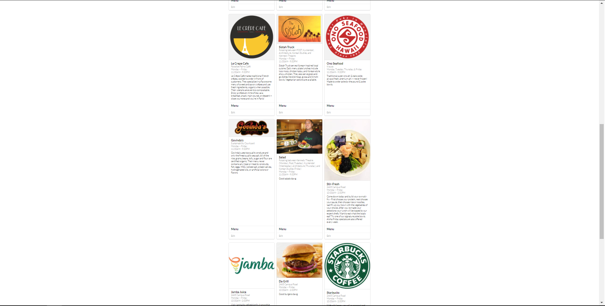

Displays a list of available restaurants or vendors. 

[Go to list restaurants page.](http://157.230.89.84/#/vendor)

### Menu page

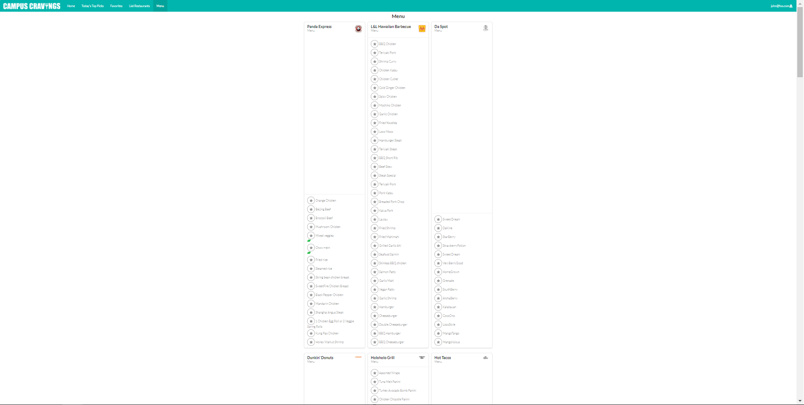
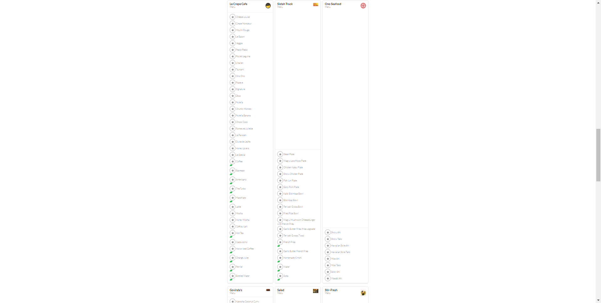

Presents foods that different establishments on campus are currently serving.

[Go to menu page.](http://157.230.89.84/#/menu)

### Today’s Top Picks page

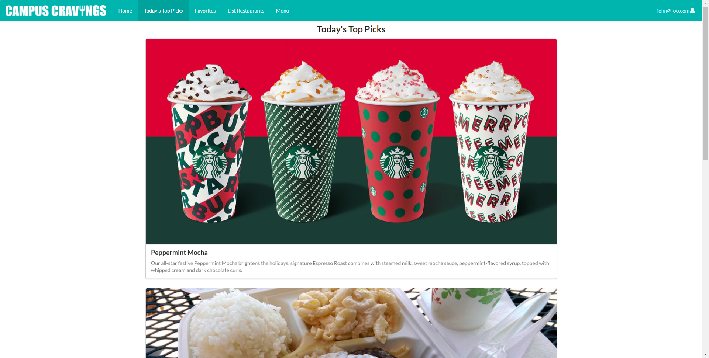
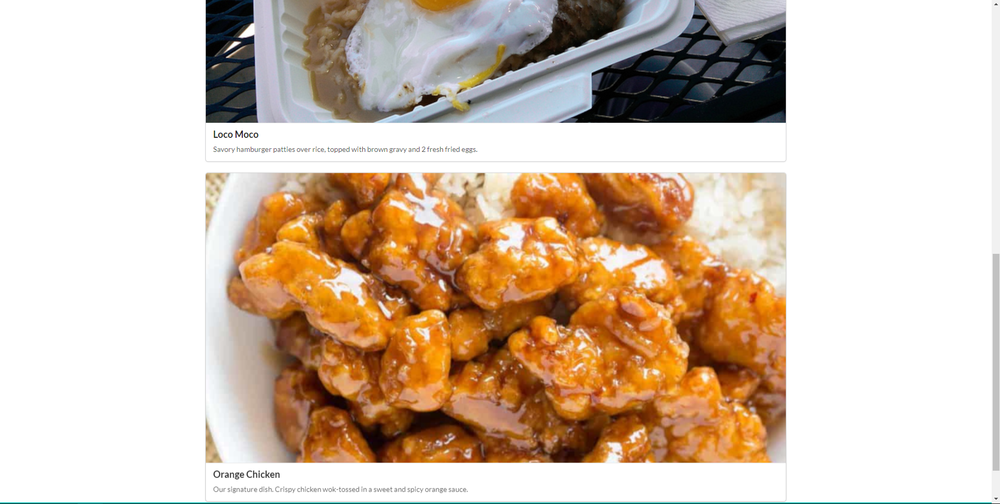

Sometimes users might want to try something new but they're unsure about what they want. This page makes it easy by showing top picks curated by restaurants. *In progress.*

[Go to today's top picks page.](http://157.230.89.84/#/todaystoppicks)

### Favorites page

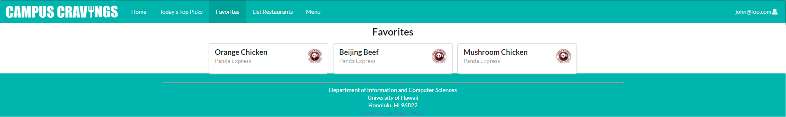

This page will show all of the current user's favorited menu items.

[Go to favorites page.](http://157.230.89.84/#/fav)

## Community Feedback

Lorem ipsum dolor sit amet, consectetur adipiscing elit. Aliquam bibendum nisi sit amet iaculis scelerisque. Integer orci velit, tempus ac tellus in, blandit sodales justo. Nam in velit in velit pretium dapibus. Nam euismod mauris vitae erat hendrerit ullamcorper. Sed suscipit posuere risus. Morbi suscipit eget purus in pulvinar. Curabitur sit amet tempus nisi, at mollis felis. Ut tincidunt elit et eros euismod, ac volutpat mauris pulvinar. Phasellus mi nulla, scelerisque a commodo nec, fermentum id neque. Nulla massa neque, suscipit et urna id, porttitor tempus elit. Nam egestas volutpat ex, vitae feugiat quam finibus posuere. Cras iaculis lectus nisl, sed faucibus elit elementum vitae. Suspendisse venenatis risus ac arcu maximus, id pharetra lorem auctor. Integer dictum, mi vel rhoncus laoreet, lorem mi varius tortor, nec sodales nibh risus vel ante. Lorem ipsum dolor sit amet, consectetur adipiscing elit.

## Developer Guide

First, [install Meteor](https://www.meteor.com/install).

Second, go to [https://github.com/campus-cravings/campus-cravings](https://github.com/aklum3/digits), and download the repo to your local file system (GitHub Desktop).

Third, cd into the app/ directory of your local copy of the repo, and install third party libraries with:

```
$ meteor npm install
```

Once the libraries are installed, you can run the application by invoking the "start" script in the [package.json file](https://github.com/ics-software-engineering/meteor-application-template-react/blob/master/app/package.json):

```
$ meteor npm run start
```

The first time you run the app, it will create some default users and data. Here is a sample output:
*(Note that the output will actually be much longer and include all the data from private/data.json)*
```
meteor npm run start

> meteor-application-template-react@ start C:\Users\johndoe\Documents\GitHub\campus-cravings\app
> meteor --no-release-check --exclude-archs web.browser.legacy,web.cordova --settings ../config/settings.development.json

[[[[[ C:\Users\johndoe\Documents\GitHub\campus-cravings\app ]]]]]

=> Started proxy.
=> Started MongoDB.
W20201201-20:12:46.335(-10)? (STDERR) Note: you are using a pure-JavaScript implementation of bcrypt.
W20201201-20:12:46.378(-10)? (STDERR) While this implementation will work correctly, it is known to be
W20201201-20:12:46.378(-10)? (STDERR) approximately three times slower than the native implementation.
W20201201-20:12:46.379(-10)? (STDERR) In order to use the native implementation instead, run
W20201201-20:12:46.379(-10)? (STDERR)
W20201201-20:12:46.379(-10)? (STDERR)   meteor npm install --save bcrypt
W20201201-20:12:46.380(-10)? (STDERR)
W20201201-20:12:46.380(-10)? (STDERR) in the root directory of your application.
I20201201-20:12:47.606(-10)? Creating the default user(s)
I20201201-20:12:47.607(-10)?   Creating user admin@foo.com.
I20201201-20:12:47.799(-10)?   Creating user vendor@foo.com.
I20201201-20:12:47.972(-10)?   Creating user john@foo.com.
I20201201-20:12:48.139(-10)?   Creating user bob@foo.com.
I20201201-20:12:48.315(-10)? Creating default data.
I20201201-20:12:48.315(-10)?   Adding: Basket (john@foo.com)
I20201201-20:12:48.335(-10)?   Adding: Bicycle (john@foo.com)
I20201201-20:12:48.336(-10)?   Adding: Banana (admin@foo.com)
I20201201-20:12:48.337(-10)?   Adding: Boogie Board (admin@foo.com)
I20201201-20:12:48.339(-10)? Creating default restaurants.
I20201201-20:12:48.339(-10)?   Adding: Panda Express
I20201201-20:12:48.359(-10)?   Adding: L&L Hawaiian Barbecue
I20201201-20:12:48.360(-10)? Creating default menu items.
I20201201-20:12:48.361(-10)?   Adding: Orange Chicken
I20201201-20:12:48.383(-10)?   Adding: Beijing Beef
I20201201-20:12:48.384(-10)?   Adding: Broccoli Beef
I20201201-20:12:48.386(-10)?   Adding: Mushroom Chicken
I20201201-20:12:48.387(-10)?   Adding: BBQ Chicken
I20201201-20:12:48.389(-10)?   Adding: Teriyaki Pork
I20201201-20:12:48.390(-10)?   Adding: Shrimp Curry
I20201201-20:12:48.391(-10)? Creating default favorites.
I20201201-20:12:48.391(-10)?   Adding: Orange Chicken
I20201201-20:12:48.410(-10)?   Adding: Beijing Beef
I20201201-20:12:48.411(-10)?   Adding: Mushroom Chicken
I20201201-20:12:48.411(-10)?   Adding: BBQ Chicken
I20201201-20:12:48.412(-10)? Loading data from private/data.json
I20201201-20:12:48.413(-10)?   Adding: Da Spot
I20201201-20:12:48.414(-10)?   Adding: Dunkin’ Donuts
I20201201-20:12:48.415(-10)?   Adding: Holoholo Grill
I20201201-20:12:48.417(-10)?   Adding: Hot Tacos
I20201201-20:12:48.418(-10)?   Adding: Kamitoku Ramen
I20201201-20:12:48.419(-10)?   Adding: The Bean Counter
I20201201-20:12:48.420(-10)?   Adding: Lasoon
I20201201-20:12:48.421(-10)?   Adding: Le Crepe Cafe
I20201201-20:12:48.422(-10)?   Adding: Sistah Truck
I20201201-20:12:48.423(-10)?   Adding: Ono Seafood
I20201201-20:12:48.424(-10)?   Adding: Govinda's
I20201201-20:12:48.426(-10)?   Adding: Salad
I20201201-20:12:48.426(-10)?   Adding: Stir-Fresh
I20201201-20:12:48.427(-10)?   Adding: Jamba Juice
I20201201-20:12:48.429(-10)?   Adding: Da Grill
I20201201-20:12:48.430(-10)?   Adding: Starbucks
I20201201-20:12:48.431(-10)?   Adding: Pizza Hut
I20201201-20:12:48.910(-10)? Monti APM: completed instrumenting the app
=> Started your app.

=> App running at: http://localhost:3000/
```

You will also get the following message when you run this application:

```
Note: you are using a pure-JavaScript implementation of bcrypt.
While this implementation will work correctly, it is known to be
approximately three times slower than the native implementation.
In order to use the native implementation instead, run

  meteor npm install --save bcrypt

in the root directory of your application.
```

On some operating systems (particularly Windows), installing bcrypt is much more difficult than implied by the above message. Bcrypt is only used in Meteor for password checking, so the performance implications are negligible until your site has very high traffic. You can safely ignore this warning without any problems during initial stages of development.

Intermittently, you may see the following error message in the console when the system starts up:

```
MongoError: not master and slaveOk=false
     at queryCallback (/Users/philipjohnson/.meteor/packages/npm-mongo/.3.1.1.1mmptof.qcqo++os+web.browser+web.browser.legacy+web.cordova/npm/node_modules/mongodb-core/lib/cursor.js:248:25)
     at /Users/philipjohnson/.meteor/packages/npm-mongo/.3.1.1.1mmptof.qcqo++os+web.browser+web.browser.legacy+web.cordova/npm/node_modules/mongodb-core/lib/connection/pool.js:532:18
     at _combinedTickCallback (internal/process/next_tick.js:131:7)
     at process._tickDomainCallback (internal/process/next_tick.js:218:9)
```

While irritating, this message appears to be harmless and [possibly related to a race condition between the development instance of Mongo and Meteor](https://github.com/meteor/meteor/issues/9026#issuecomment-330850366). By harmless, I mean that in most cases, the console goes on to display `App running at: http://localhost:3000/` and no problems occur during run time.

If all goes well, the template application will appear at [http://localhost:3000](http://localhost:3000).  You can login using the credentials in [settings.development.json](https://github.com/ics-software-engineering/meteor-application-template-react/blob/master/config/settings.development.json), or else register a new account.

You can verify that the code obeys our coding standards by running ESLint over the code in the imports/ directory with:

```
meteor npm run lint
```

## Milestones

### M1

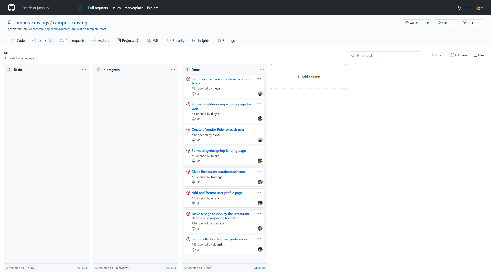

Our finished M1 can be found [here](https://github.com/campus-cravings/campus-cravings/projects/1).

### M2

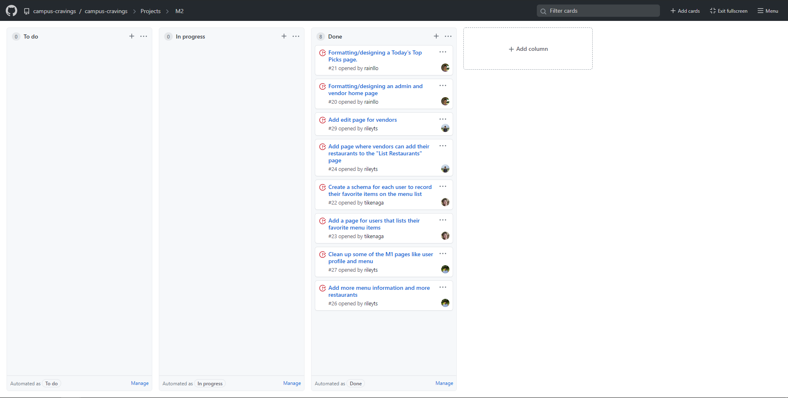
Our finished M2 can be found [here](https://github.com/campus-cravings/campus-cravings/projects/2).

### M3

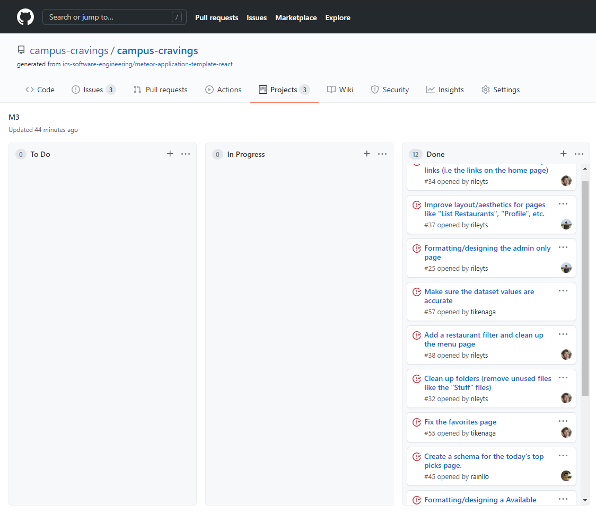
Our finished M3 can be found [here](https://github.com/campus-cravings/campus-cravings/projects/4).

## The Team
*Created by [Alexander Lum](https://aklum3.github.io/), [Rainier Javillo](https://rainllo.github.io/), [Riley Sodetani](https://rileyts.github.io/), and [Ty Ikenaga](https://tikenaga.github.io/).*
